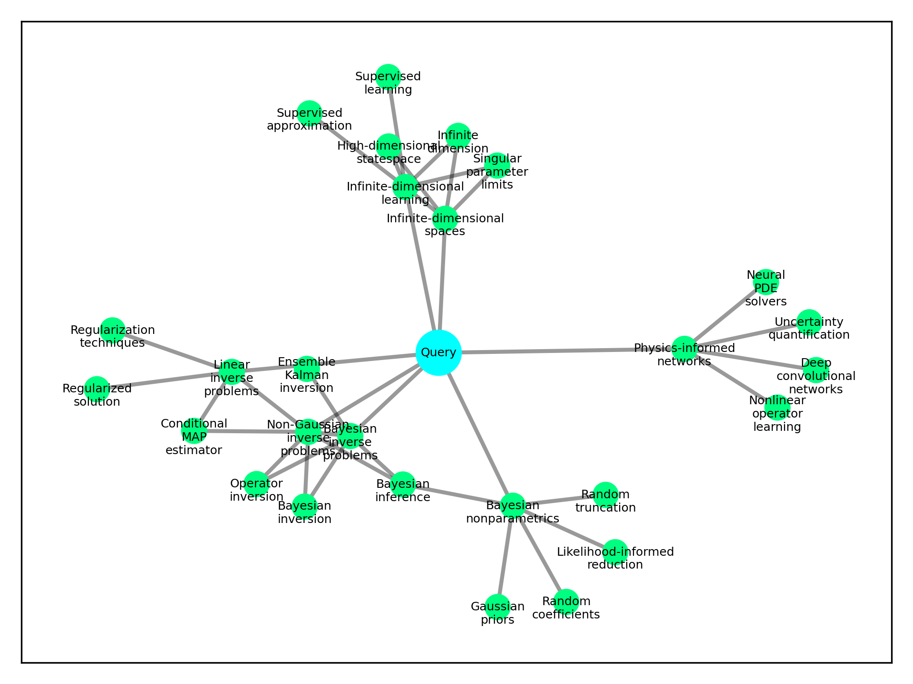
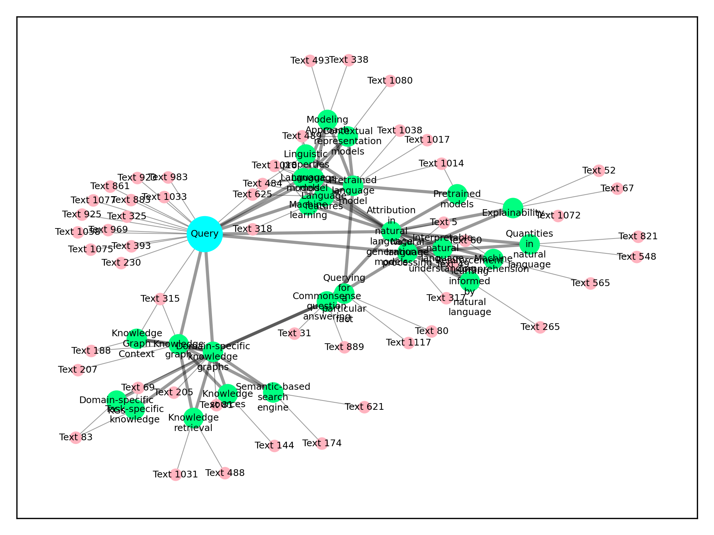

# AutoKG - Efficient Automated Knowledge Graph Generation for Large Language Models

## Background & Motivation
Enhancing the output of large language models (LLMs) is now more accessible by linking them to specific knowledge bases. 
This connection grants the model direct access to pertinent knowledge related to an input query, thereby increasing the 
accuracy and depth of the response.

Currently, knowledge bases are accessed mainly through vector similarity search, where an input query is vectorized and 
searched within the knowledge base. Though efficient, this method is limited in its ability to retrieve information beyond 
semantic relation, and it may miss broader connections or underlying principles. For example, a query about a scientific 
concept might yield related terms but overlook comprehensive connections.

The integration of knowledge graphs can address these limitations, offering more complex reasoning and knowledge expansion. 
However, building and using knowledge graphs is relatively expensive and complex. It often involves fine-tuning large 
models for extracting entities and relationships, a process much more intricate than mere vectorization. Additionally, 
invoking information from the knowledge graph may require logical structures to understand the relational dynamics, 
adding another layer of complexity. 

The challenges and complexities associated with using knowledge graphs, as previously mentioned, have motivated us to 
contemplate a more lightweight approach to constructing knowledge graphs. We aimed to find a method that does not require 
fine-tuning models or processing the entire corpus, and yet offers a level of simplicity akin to the vector similarity method, 
where information can be conveniently conveyed to the model through a prompt. This line of thinking has led to the 
development of my project, AutoKG.

## Introduction
In our project, AutoKG, we present a novel approach to efficiently building lightweight knowledge graphs based on existing knowledge bases, significantly reducing the complexities involved in leveraging knowledge graphs to enhance language models. I am currently drafting a technical paper detailing our methodology, which I plan to publish on arXiv.

The strategy behind AutoKG begins with extracting key terms or keywords from the knowledge base and then constructing a graph structure on these keywords. Importantly, the edges within this graph structure are not characterized by complex attributes but are assigned a positive integer weight. These weights represent the strength of association (not semantic relevance) between two connected keywords within the entire corpus (with 0 indicating no association).

Utilizing this graph structure, we have devised a hybrid search scheme that conducts simultaneous searches for vector-similarity-based text and graph-based strongly associated keywords. All retrieved information is incorporated into the prompt to bolster the model's response, allowing it not only to comprehend information directly related to the input query but also to gain access to more extensive, interconnected information.

A concrete example with a localized visualization of the knowledge graph will follow, further illustrating how AutoKG functions and demonstrating its potential to offer more insightful and comprehensive responses from language models.

## Flowcharts
Here we use two flowcharts to illustrate our proposed automated KG construction method and mixture search method.
### Keywords Extraction and KG Construction

### Mixture Search: Vector Similarity + KG

## How to Use
1. **Clone the Repository**: `git clone https://github.com/wispcarey/AutoKG.git`
2. **Prerequisites**: Python 3.9 or 3.10
3. **Installation**: Install necessary packages:`pip install -r requirements.txt`

## Chat with the Knowledge graph 
We offer a concrete example to demonstrate how to construct a 
knowledge graph using our innovative method. We've downloaded a collection of 
research papers (in `raw_data`) related to building knowledge graphs using language models, 
and with these papers and our approach, we will show how to create a knowledge graph and use 
it to reinforce the performance of Language models.

The example is shown in two main Jupyter Notebooks:
- **`create_KG.ipynb`**: This notebook illustrates how to extract keywords from the selected papers and generate a knowledge graph based on these keywords. The entire process is automated, intuitive, and easy to follow.
- **`chat_with_KG.ipynb`**: This notebook provides an example of how to engage in question and answer interactions using the knowledge graph we've built. Through this example, users can understand how to apply the constructed knowledge graph to real language processing scenarios.

## A chat example
### Query:
>Please tell me how to use pre-trained language models to construct a knowledge graph.

### Subgraph Visualization:
Here is a visualization of the keyword subgraph related to the query. From the query, we search keywords via two steps, 
the similarity search and the adjacency search. In the similarity search process, we search some keywords from the knowledge
graph according to the similarity to the query. Then we process the adjacency search, we search more keywords based on graph
weights (which measures the strength of the connection) to those keywords selected by the similarity search process.

Keywords selected by our two-step search process and their connections are visualized below (green nodes). We only show whether there 
is a connection but not the strength of the connection. 

Then we select the corpus information passed to the model through the prompt. One part is from the vector similarity to the query.
The other is selected from the related corpus of selected keywords. The subgraph with related corpus nodes (pink nodes) are visualized below.

### Model (GPT-3.5) Response with KG Information:

>Pre-trained language models (LLMs) can be used to construct knowledge graphs (KGs) by leveraging the knowledge stored in the LLMs. There are several approaches to achieve this.
>
>One approach is to use unsupervised methods like MAMA (Minimal User Input Approach) or GPT-4. These methods involve a single forward pass of the pre-trained LLMs over a corpus without any fine-tuning. The LLMs generate prompts that express the target relation in a diverse way. The prompts are then weighted with confidence scores, and the LLM is used to search a large collection of candidate entity pairs. The top entity pairs are then ranked and outputted as the knowledge in the KG.
>
>Another approach is to use supervised methods like KG-Net or QA-GNN. These methods ground the results generated by LLMs at each reasoning step by using knowledge graphs. The LLMs generate outputs that guide a graph neural network to perform message passing. This process utilizes the explicit knowledge contained in the structured knowledge graph for reasoning purposes.
>
>Additionally, there are methods that distill knowledge from LLMs to construct KGs. These methods use existing tuples as a seed set of knowledge on which to train the LLMs. The LLMs learn to adapt their learned representations to knowledge generation and produce novel tuples that are of high quality. Experimental results have shown that implicit knowledge from LLMs can be transferred to generate explicit knowledge in KGs.
>
>Overall, pre-trained LLMs can be used to construct KGs by leveraging their ability to generate diverse prompts, perform reasoning on KGs, and distill knowledge. These approaches provide a way to utilize the knowledge stored in LLMs to construct structured and interpretable knowledge graphs.
