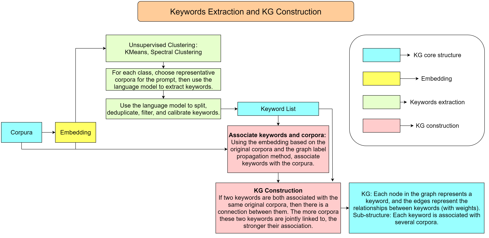
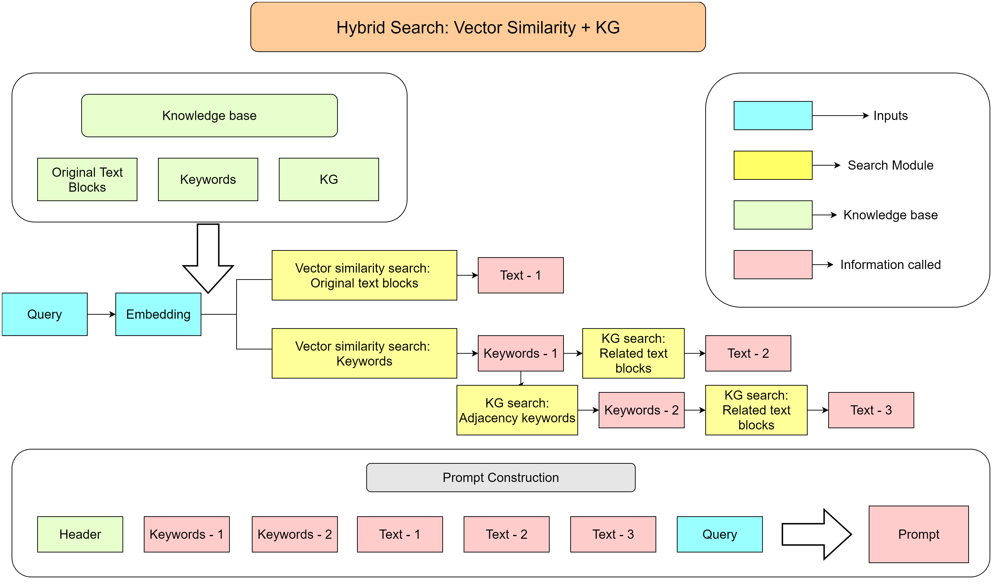

# AutoKG - Efficient Automated Knowledge Graph Generation for Large Language Models

## Background & Motivation

Connecting large language models with specific knowledge bases enhances the accuracy and depth of the model's output.
Currently, knowledge bases are primarily accessed through vector similarity search, which has limitations in retrieving
complex associative information. Knowledge graphs can address these limitations by providing more complex reasoning and
knowledge expansion. However, building and using knowledge graphs is relatively expensive and complex. These challenges
have motivated us to consider a more lightweight approach to constructing knowledge graphs, one that does not require
fine-tuning models or processing the entire corpus while offering the simplicity akin to the vector similarity method.
This line of thinking has led to the development of our AutoKG project.

## Introduction

We present a novel approach to efficiently build lightweight knowledge graphs based on existing knowledge bases,
significantly reducing the complexities involved in leveraging knowledge graphs to enhance language models. Our strategy
involves extracting key terms from the knowledge base and constructing a graph structure on these keywords. The edges in
the graph are assigned a positive integer weight, representing the strength of association between two connected
keywords within the entire corpus. Utilizing this graph structure, we have designed a hybrid search scheme that
simultaneously conducts vector-similarity-based text search and graph-based strongly associated keyword search. All
retrieved information is incorporated into the prompt to enhance the model's response. Please refer to [our paper](https://ieeexplore.ieee.org/abstract/document/10386454)
for more details.

## Flowcharts

Here we use two flowcharts to illustrate our proposed automated KG construction method and mixture search method.

### Keywords Extraction and KG Construction



### Mixture Search: Vector Similarity + KG



## How to Use

1. **Clone the Repository**: `git clone https://github.com/wispcarey/AutoKG.git`
2. **Prerequisites**: Python 3.9 or 3.10
3. **Installation**: Install necessary packages:`pip install -r requirements.txt`
4. **Your OpenAI API key**: Input your openai api key in `config`

## Chat with the Knowledge graph

We offer a concrete example to demonstrate how to construct a knowledge graph using our innovative method. We've
downloaded a collection of research papers (in `raw_data`) related to building knowledge graphs using language models,
and with these papers and our approach, we will show how to create a knowledge graph and use it to reinforce the
performance of Language models.

The example is shown in two main Jupyter Notebooks:

- **`create_KG.ipynb`**: This notebook illustrates how to extract keywords from the selected papers and generate a
  knowledge graph based on these keywords. The entire process is automated, intuitive, and easy to follow.
- **`chat_with_KG.ipynb`**: This notebook provides an example of how to engage in question and answer interactions using
  the knowledge graph we've built. Through this example, users can understand how to apply the constructed knowledge
  graph to real language processing scenarios.

## Citation

If you use this tool or data in your research, please cite our paper [IEEE Xplore](https://ieeexplore.ieee.org/abstract/document/10386454):

```bibtex
@inproceedings{chen2023autokg,
  title={AutoKG: Efficient Automated Knowledge Graph Generation for Language Models},
  author={Chen, Bohan and Bertozzi, Andrea L},
  booktitle={2023 IEEE International Conference on Big Data (BigData)},
  pages={3117--3126},
  year={2023},
  organization={IEEE}
}
```

